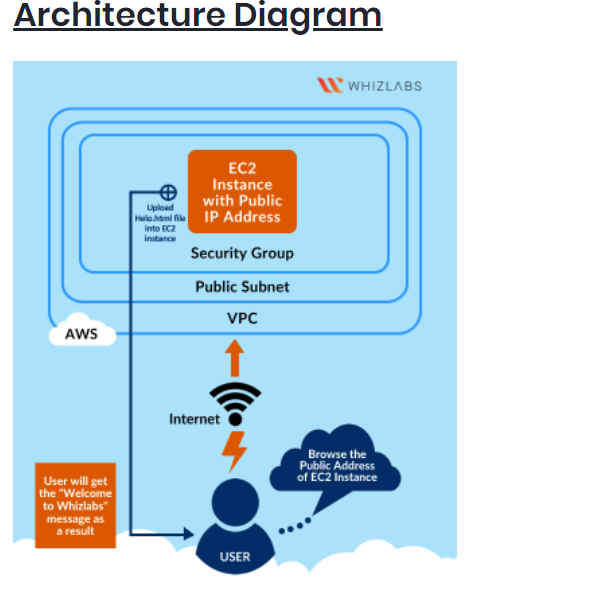

# What is EC2

- AWS defines it as Elastic Compute Cloud.

- It’s a virtual environment where “you rent” to have your environment created, without purchasing.

- Amazon refers to these virtual machines as Instances.

- Preconfigured templates can be used to launch instances. These templates are referred to as images. Amazon provides these images in the form of AMIs (Amazon Machine Images).

- Allows you to install custom applications and services.

- Scaling of infrastructure i.e., up or down is easy based on the demand you face.

- AWS provides multiple configurations of CPU, memory, storage etc., through which you can pick the flavor that's required for your environment.

- **No limitation on storage.** You can pick the storage based on the type of the instance that you are working on.

- **Temporary storage volumes are provided, which are called Instance Store Volumes.**  
  - Data stored in this gets deleted once the instance is terminated.

- **Persistent storage volumes are available and are referred to as EBS (Elastic Block Store) volumes**.

- These instances can be placed at multiple locations which are referred to as Regions and Availability Zones (AZ).

- You can have your Instances distributed across multiple AZs i.e., within a single Region, so that if an instance fails, AWS automatically remaps the address to another AZ.

- Instances deployed in one AZ can be migrated to another AZ.

- To manage instances, images, and other EC2 resources, you can optionally assign your own metadata to each resource in the form of tags.

- A Tag is a label that you assign to an AWS resource.  It contains a key and an optional value, both of which are defined by you.

- Each AWS account comes with a set of default limits on the resources on a per-Region basis.

- For any increase in the limit you need to contact AWS.

- To work with the created instances, we use Key Pairs. 

## EC2 Architecture

