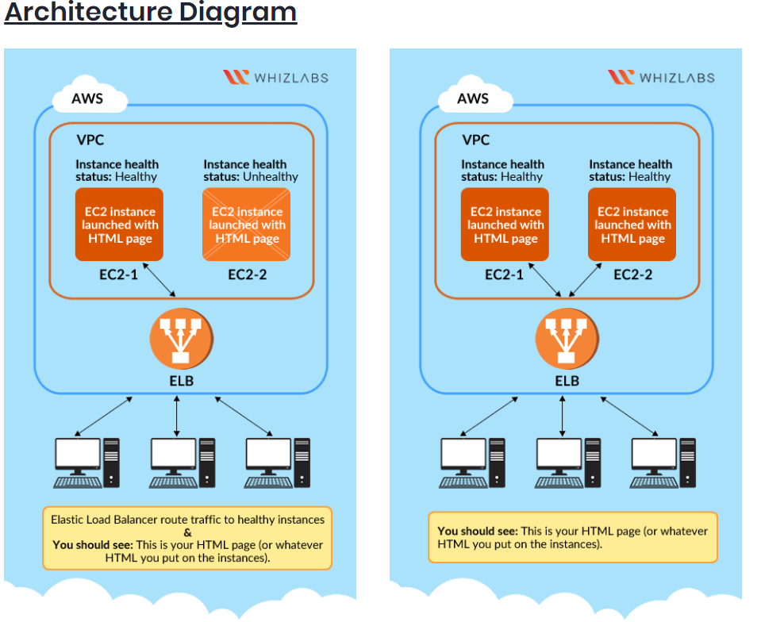

# creating ELB

# What is Elastic Load Balancing?

- **ELB is a service that automatically distributes incoming application traffic and scale resources to meet traffic demands.**

- ELB helps to adjust capacity as per incoming traffic.

- can be **enabled within a single availability zone or across multiple availability zones**

- **ELB offers features like:**
  - Detection of unhealthy EC2 instances. 
  - Spreading EC2 instances across healthy channels only. 
  - Centralized management of SSL certificates. 
  - Optional public key authentication. 
  - Support for both IPv4 and IPv6.

- **ELB accepts incoming traffic from clients and routes requests to its registered targets.**

- When an unhealthy target or instance is detected, ELB stops routing traffic to it and resumes only when the instance is healthy again.

- ELB monitors the health of its registered targets and ensures that the traffic is routed only to healthy instances.

- ELB's are configured to accept incoming traffic by specifying one or more listeners. A listener is a process that checks for connection requests.

- Listeners are configured with a protocol and port number from the client to the ELB and vice-versa i.e., back from ELB to the client.

## **ELB supports 3 types of load balancers**:
- Application Load Balancers 
- Network Load Balancers 
- Classic Load Balancers
  

- Each load balancer is configured differently. 
- For Application and Network Load Balancers, you register targets in target groups and route traffic to target groups. 
- For Classic Load Balancers, you register instances with the load balancer.

- **AWS recommends users to work with Application Load Balancer to use multiple Availability Zones because if one availability zone fails, the load balancer can continue to route traffic to the next available one**.

 - We can have our load balancer be either internal or internet-facing.

- The nodes of an internet-facing load balancer have Public IP addresses, and the DNS name is publicly resolvable to the Public IP addresses of the nodes.

  - Due to the point above, internet-facing load balancers can route requests from clients over the Internet.

  - The nodes of an internal load balancer have only Private IP addresses, and the DNS name is publicly resolvable to the Private IP addresses of the nodes.

  - Due to the point above, internal load balancers can only route requests from clients with access to the VPC for the load balancer.

  - Both internet-facing and internal load balancers route requests to your targets using Private IP addresses.

  - Your targets do not need Public IP addresses to receive requests from an internal or an internet-facing load balancer.

## ELB Architecture diagram

