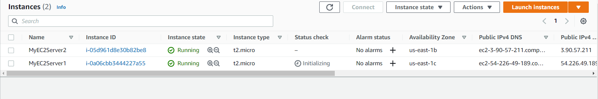
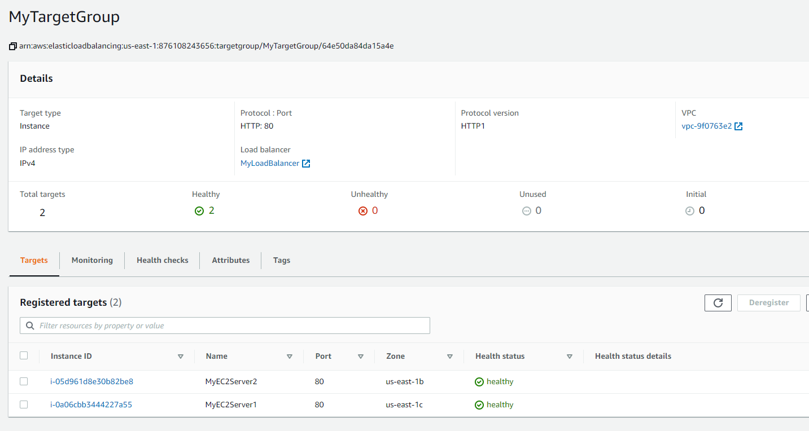
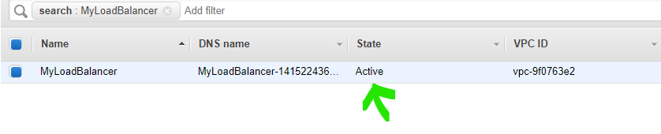
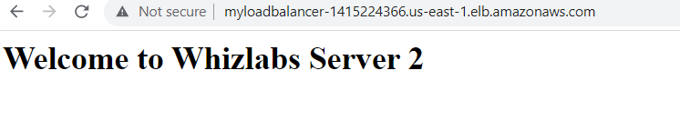
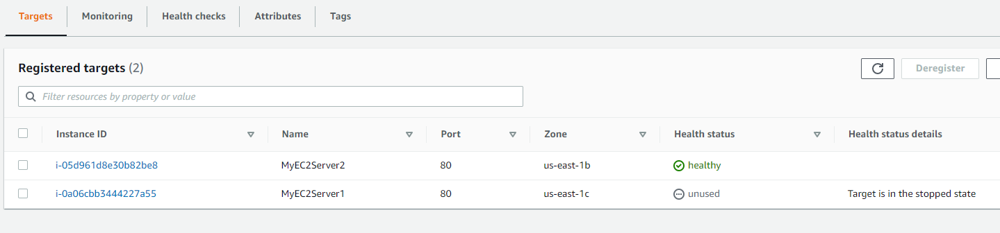

# ELB Task Details


1. Log into AWS Management Console.

2. Launching First EC2 Instance.

3. Launching Second EC2 Instances.

4. Creating the Load Balancer and Target Group.

5. Testing the Elastic Load Balancer.

6. Validation of the lab.

7. Deleting AWS Resources.


## Steps:

- created EC2 instance as per [1.3_ELB_how_to.pdf](1.3_ELB_how_to.pdf)
- getting error
```text
There was a problem connecting to your instance
We were unable to connect to your instance. Verify that your IAM policy is correctly configured to use EC2 Instance Connect.

Resolution: we need not connect to EC2 instance here as its not mentioend in guide.
```

- Both instances running:



- Next we create loadbalancer
  - Create Target Group (A target group tells a load balancer where to direct traffic to : EC2 instances, fixed IP addresses; or AWS Lambda functions, amongst others)
  - Create Application LoadBalancer as per document

- Testing the Elastic Load Balancer
  - Navigate to your Target Group created and check if instances status changes to healthy
  - 
  - check if status of ELB is Active
  - 
  - Copy ELB DNS name and check in browser:
  - 
  - Stop instance MyEC2Server1
  - When we now go to our Target Group it will show instance1 health status as `unused`
  - 
  - And ELB DNS will now direct all traffic to instance 2 only. 
  - Delete LB then Delete Target group and then Terminate both instances before you end lab. 

 
 