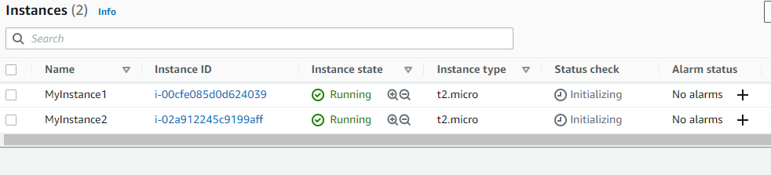

# Cloud Challenge Details

- Your company is considering migrating a web application from an on-premise server to Amazon Elastic Compute Cloud (EC2). You have been tasked with setting up example infrastructure for hosting the web application and testing the path based routing with the help of Elastic Load Balancing (ELB).

- In this lab challenge, you will use the AWS Management Console to complete the tasks that result in provisioning infrastructure to fulfill your company's requirements.

- Follow the instructions given below to work on the challenge.

- Create TWO Amazon EC2 Instances.

  - Admin EC2 Instance

    - Select Amazon Linux 2 AMI and t2.micro instance type with basic configuration.

    - SSH into the EC2 Instance and install apache server.

    - Host the admin HTML page mentioned below in EC2 Instance.

    - https://challengetask10049.s3.amazonaws.com/admin/index.html
  - User EC2 Instance
    - Select Amazon Linux 2 AMI and t2.micro instance type with basic configuration..
    - SSH into the EC2 Instance and install apache server. 
    - Host the user HTML page mentioned below in EC2 Instance.
    - https://challengetask10049.s3.amazonaws.com/user/index.html
  - Create an Elastic Load Balancer.
    - If you enter the dns name with /admin, the request should be forwarded to EC2 Instance containing the admin HTML page.
    - If you enter the dns name with /user, the request should be forwarded to EC2 Instance containing the user HTML page. 
    - Any other path should be redirected to a success static plain text page with a note "Whizlabs ELB Challenge".


## Solution:

- Created 2 EC2 instances manually : MyInstance1 and MyInstance2
- 
- Use Puttygen tool to import .pem file and generate .ppk and .pub keys. 
- Login using Putty to both instances
- install apache as per following:
```text
sudo su
yum -y update
yum install httpd -y
systemctl start httpd
systemctl enable httpd
systemctl status httpd
```

- http://34.224.18.29 and http://3.82.60.13/ -> redirecting to apache home page 
- apache files located here  /etc/httpd/conf 
- added following to httpd.conf in instance1:
```text
 <VirtualHost *:80>
ServerName localhost
Redirect 301 / https://challengetask10049.s3.amazonaws.com/admin/index.html
</VirtualHost>
```
- added following to httpd.conf in instance2:
```text
<VirtualHost *:80>
ServerName localhost
Redirect 301 / https://challengetask10049.s3.amazonaws.com/user/index.html
</VirtualHost>
```
- Now instance1 is redirecting to admin and instance 2 is redirecting to user page. 
- 